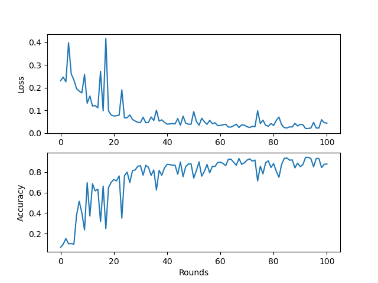

<script
  src="https://cdn.mathjax.org/mathjax/latest/MathJax.js?config=TeX-AMS-MML_HTMLorMML"
  type="text/javascript">
</script>

# SFD: Straggler-Follower Delegation for Mitigating Device Heterogeneity in Federated Learning

> Note: If you use this baseline in your work, please remember to cite the original authors of the paper as well as the Flower paper.

**Paper link:** 

**Authors:** Eduard Burlacu, Stylianos Venieris, Aaron Zhao, Robert Mullins

**Abstract:** 


## About this baseline
**What's implemented:** Source code used for producing the results in SFD paper.

**Datasets:**
* MNIST from PyTorch's Torchvision
* CIFAR10 from PyTorch's Torchvision
* Sent140 from LEAF benchmark, processed as in FedProx paper
* Shakespeare from LEAF benchmark, processed as in FedProx paper
* Synthetic datasets as in LEAF paper
 
**Hardware Setup:** These experiments were run on a desktop machine with 20 CPU threads. Any machine with 20 CPU cores or more would be able to run it as expected. For a device with N threads, the FL setting can be simulated by selecting \\[ frac{N}{2} \\] devices each round. 
Why? the scheduler can call at most N more devices as followers and concurrency is important to properly simulate the FL setting.

**Note**: we install PyTorch with GPU support but by default. However, the entire experiment can run on CPU-only mode as explained below.

**Contributors:** Eduard Burlacu


## Experimental Setup
# Experiment 1: Optimizing training time for classic FL network topology
**TaskS:** We first test our offloading strategy by direct offloading $ \exp $  under 3
* Image classification for MNIST
* Image classification for CIFAR10
* Sentiment analysis for Sent140


**Model:** This directory implements three models:
* A logistic regression model used in the FedProx paper for MNIST (see `models/LogisticRegression`). This is the model used by default.
* A two-layer CNN network as used in the FedAvg paper for MNIST (see `models/Net`)
* A two-layer CNN network as used in in the FedAvg paper for CIFAR10  (see `models/CNN_CIFAR`)
**Dataset:** This baseline only includes the MNIST dataset. By default it will be partitioned into 1000 clients following a pathological split where each client has examples of two (out of ten) class labels. The number of examples in each client is derived by sampling from a powerlaw distribution. The settings are as follow:

| Dataset | #classes | #partitions | partitioning method | partition settings |
| :------ | :---: | :---: | :---: | :---: |
| MNIST | 10 | 1000 | pathological with power law | 2 classes per client |

**Training Hyperparameters:**
The following table shows the main hyperparameters for this baseline with their default value (i.e. the value used if you run `python main.py` directly)

| Description | Default Value |
| ----------- | ----- |
| total clients | 1000 |
| clients per round | 10 |
| number of rounds | 100 |
| client resources | {'num_cpus': 2.0, 'num_gpus': 0.0 }|
| data partition | pathological with power law (2 classes per client) |
| optimizer | SGD with proximal term |
| proximal mu | 1.0 |
| stragglers_fraction | 0.9 |

## Environment Setup

To construct the Python environment follow these steps:

```bash
# install the base Poetry environment
poetry install

# activate the environment
poetry shell

# install PyTorch with GPU support. Please note this baseline is very lightweight so it can run fine on a CPU.
pip install torch==1.13.1+cu116 torchvision==0.14.1+cu116 torchaudio==0.13.1 --extra-index-url https://download.pytorch.org/whl/cu116
```

## Running the Experiments

To run this FedProx with MNIST baseline, first ensure you have activated your Poetry environment (execute `poetry shell` from this directory), then:

```bash
python -m fedprox.main # this will run using the default settings in the `conf/config.yaml`

# you can override settings directly from the command line
python -m fedprox.main mu=1 num_rounds=200 # will set proximal mu to 1 and the number of rounds to 200

# if you run this baseline with a larger model, you might want to use the GPU (not used by default).
# you can enable this by overriding the `server_device` and `client_resources` config. For example
# the below will run the server model on the GPU and 4 clients will be allowed to run concurrently on a GPU (assuming you also meet the CPU criteria for clients)
python -m fedprox.main server_device=cuda client_resources.num_gpus=0.25
```

To run using FedAvg:
```bash
# this will use a variation of FedAvg that drops the clients that were flagged as stragglers
# This is done so to match the experimental setup in the FedProx paper
python -m fedprox.main --config-name fedavg

# this config can also be overriden from the CLI
```

## Expected results

With the following command we run both FedProx and FedAvg configurations while iterating through different values of `mu` and `stragglers_fraction`. We ran each experiment five times (this is achieved by artificially adding an extra element to the config but that it doesn't have an impact on the FL setting `'+repeat_num=range(5)'`)

```bash
python -m fedprox.main --multirun mu=0.0,2.0 stragglers_fraction=0.0,0.5,0.9 '+repeat_num=range(5)'
# note that for FedAvg we don't want to change the proximal term mu since it should be kept at 0.0
python -m fedprox.main --config-name fedavg --multirun stragglers_fraction=0.0,0.5,0.9 '+repeat_num=range(5)'
```

The above commands would generate results that you can plot and would look like:

