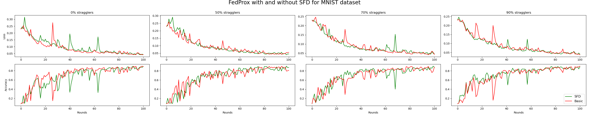

# SFD: Straggler-Follower Delegation for Mitigating Device Heterogeneity in Federated Learning

> Note: If you use this baseline in your work, please remember to cite the original authors of the paper as well as the Flower paper.

**Paper link:** 

**Authors:** Eduard Burlacu, Stylianos Venieris, Aaron Zhao, Robert Mullins

**Abstract:** 


## About this baseline
**What's implemented:** Source code used for producing the results in SFD paper.

**Datasets:**
* MNIST from PyTorch's Torchvision
* CIFAR10 from PyTorch's Torchvision
* Sent140 from LEAF benchmark, processed as in FedProx paper
* Shakespeare from LEAF benchmark, processed as in FedProx paper
* Synthetic datasets as in LEAF paper
 
**Hardware Setup:** These experiments were run on a desktop machine with 20 CPU threads. Any machine with 20 CPU cores or more would be able to run it as expected. For a device with N threads, the FL setting can be simulated by selecting \\[ frac{N}{2} \\] devices each round. 
Why? the scheduler can call at most N more devices as followers and concurrency is important to properly simulate the FL setting.

**Note**: we install PyTorch with GPU support but by default. However, the entire experiment can run on CPU-only mode as explained below.

**Contributor:** Eduard Burlacu

## Environment Setup

To construct the Python environment follow these steps:
```bash
# install the base Poetry environment
poetry install

# activate the environment
poetry shell

# install PyTorch with GPU support. Please note this baseline is very lightweight so it can run fine on a CPU.
pip install torch==1.13.1+cu116 torchvision==0.14.1+cu116 torchaudio==0.13.1 --extra-index-url https://download.pytorch.org/whl/cu116
#install TorchRL for training the agent.
pip install git+https://github.com/pytorch/rl@v0.1.0
```

## Experiments
### Experiment 1: Optimizing training time for classic FL network topology
**Motivation:** Using shallow models implies that there is a limited, narrow, set of split points. There is often an uneven number of operations per layer, making the optimal choice obvious by assessing #computations per layer. For example, a CNN may be split as no computation on straggler + full computation on follower(with which we actually experiment) or Conv2D computation on straggler + full computation on follower. For such cases, the direct exprimenting with these few options is feasible.  

**Tasks:** We first test our strategy by direct offloading (n = 0). We apply this to tasks from 3 different settings, i.e. vision, language, synthetic data. 
* Image classification for MNIST
* Image classification for CIFAR10
* Sentiment analysis for Sent140
* Next letter prediction with Shakespeare
* Regression with synthetic datasets

**Models:** This directory implements the following models models:
* A logistic regression model used in the FedProx paper for MNIST. This is the model used by default.
* A two-layer CNN network as used in the FedAvg paper for MNIST (see `models/Net`)
* A two-layer CNN network as used in the FedAvg paper for CIFAR10  (see `models/CNN_CIFAR`)
* A two-layer LSTM network as used in FedProx paper for Sent140  (see `models/LSTM_SENT`)
* A two-layer LSTM network as used in FedProx paper for Shakespeare  (see `models/LSTM_SHAKESPEARE`)

For details, see `src/models` for MNIST and CIFAR models and `src/Models/` for the rest.

**Datasets:**  The settings are as follows:

| Dataset     | #classes | #partitions |       partitioning method       |     partition settings      |
|:------------|:--------:|:-----------:|:-------------------------------:|:---------------------------:|
| MNIST       |    10    |    1000     |   pathological with power law   |    2 classes per client     |
| CIFAR10     |    10    |    1000     | Latent Dirichlet Allocation (α) |    10 classes per client    |
| Sent140     |    2     |    1000     |      Each client is a user      |              -              |
| Shakespeare |    80    |    1129     |   Each client is a persoange    |              -              |
| Synth(α, β) |    30    |    1000     |      Distribution Sampling      | (α, β) control i.i.d. -ness |


**Training Hyperparameters:**
The following table shows the main hyperparameters for this baseline with their default value i.e. the value used if you run 
```bash
bash src/script/run.sh
```

| Description         | Default Value                                    |
|---------------------|--------------------------------------------------|
| dataset             | MNIST                                            |
| total clients       | 1000                                             |
| clients per round   | 10                                               |
| number of rounds    | 100                                              |
| client resources    | {"num_cpus": 1.0, "num_gpus": 0.0 }              |
| data partition      | pathological with power law (2 classes per client) |
| optimizer           | SGD with proximal term and momentum=0.9          |
| proximal mu         | 2.0                                              |
| stragglers_fraction | 0.5                                              |
| n (split layer)     | 0                                                |

### Experiment 2: Training an RL agent to optimally split the networks
**Motivation:** The arise of large models such as LLMs implies that the inference time becomes significantly larger than in the communication time. Thus, an optimal split point can lead lo large savings for the train time. This idea is exploited by Split Learning which serializes the collaborative learning. As the core of these models usually represents chaining several submodules, we will perform experiments with architecturs made of identical building blocks, as listed in Models.

**Task:** Image classification for MNIST

**Models:**
* ResNet
* VGG

For details about models, see `src/Models/resnet` and `src/Models/vgg`. 

For details about environments, refer to the paper.

**Dataset:**  The settings are as follows:

| Dataset     | #classes | #partitions |       partitioning method       |     partition settings      |
|:------------|:--------:|:-----------:|:-------------------------------:|:---------------------------:|
| MNIST       |    10    |    1000     |   pathological with power law   |    2 classes per client     |
| CIFAR10     |    10    |    1000     | Latent Dirichlet Allocation (α) |    10 classes per client    |
| Shakespeare |    80    |    1129     |   Each client is a persoange    |              -              |

### Experiment 3:
**Motivation:** We now test the impact of our trained agent under the same environment as described in experiment 1 and assess the improvements.   

**Tasks:** as in experiment 1

**Models:** as in experiment 2

**Dataset:**  as in experiment 1
We use Sent140 and synthetic datasets to assess how well the agent generalises to environments involving unforeseen datasets.

| Dataset     | #classes | #partitions |       partitioning method       |     partition settings      |
|:------------|:--------:|:-----------:|:-------------------------------:|:---------------------------:|
| MNIST       |    10    |    1000     |   pathological with power law   |    2 classes per client     |
| CIFAR10     |    10    |    1000     | Latent Dirichlet Allocation (α) |    10 classes per client    |
| Sent140     |    2     |    1000     |      Each client is a user      |              -              |
| Shakespeare |    80    |    1129     |   Each client is a persoange    |              -              |
| Synth(α, β) |    30    |    1000     |      Distribution Sampling      | (α, β) control i.i.d. -ness |

### Experiment 4:
**Motivation:** We now generalise our findings into the general setting of collaborative learning. A client may not always correspond to just a device, and different privacy levels impose a network topology. Settings like IoT(edge devices as unique, already assigned followers for each device), FL(dataflow private), SL(one cluster, trusted dataflow),or those already experimented in SL - FL hybrids like SFL or FedAdapt(one cluster, unique follower) can all be generalised as 2 network topologies, one of collaborative learning(FL) and a dataflow topology set by trust regions(the "span" of SL).

While a network may have N devices, those may correspond to just a few actual clients. We explit this clustering at dataflow level to accelerate training within the allowed trust region.  Now we experiment in realist setting where the dataflow is contrlled as described in paper.
## Running the Experiments
### Example
To run this FedProx with MNIST baseline, first ensure you have activated your Poetry environment (execute `poetry shell` from this directory), then:

```bash
bash src/scipt/run.sh # this will run using the default settings in the `conf/config.yaml`
```
```bash
#to choose the desired configuration, pass the name as argument:
bash src/script/run.sh --config-name fedoffload_cifar10
```
```bash
# you can override configuration settings directly from the command line
bash src/script/run.sh --config-name fedoffload_cifar10 mu=1 num_rounds=200 # will set proximal mu to 1 and the number of rounds to 200
```
```bash
# if you run this baseline with a larger model, you might want to use the GPU (not used by default).
# you can enable this by overriding the `server_device` and `client_resources` config. For example
# the below will run the server model on the GPU and 10 clients will be allowed to run concurrently on a GPU (assuming you also meet the CPU criteria for clients)
bash src/script/run.sh server_device=cuda client_resources.num_gpus=0.10
```

To run using FedAvg:
```bash
# this will use a variation of FedAvg that drops the clients that were flagged as stragglers
# This is done so to match the experimental setup in the FedProx paper
bash src/script/run.sh --config-name fedavg

# this config can also be overriden from the CLI
```

### Expected results
#### Experiment 1
With the following command we run **FedProx** and **FedAvg** configurations with/without **SFD** while iterating through different values of `mu` and `stragglers_fraction`. We ran each experiment five times (this is achieved by artificially adding an extra element to the config but that it doesn't have an impact on the FL setting `'+repeat_num=range(5)'`)

```bash
bash src/script/run.sh --config_name fedoffload_mnist --multirun mu=0.0,1.0,2.0 stragglers_fraction=0.0,0.5,0.7,0.9
bash src/script/run.sh --config-name fedprox_mnist --multirun mu=0.0,1.0,2.0 stragglers_fraction=0.0,0.5,0.7,0.9
```


```bash
bash src/script/run.sh --config-name fedoffload_cifar10 --multirun mu=0.0 stragglers_fraction=0.0,0.1,0.2,0.3,0.4,0.5,0.6,0.7,0.8,0.9
bash src/script/run.sh --config-name fedprox_cifar10 --multirun mu=0.0 stragglers_fraction=0.0,0.1,0.2,0.3,0.4,0.5,0.6,0.7,0.8,0.9
```

The above commands would generate results that you can plot and would look like:



#### Experiment 2
```bash
# not implemented yet
```


#### Experiment 3
```bash
# not implemented yet
```


#### Experiment 4
```bash
# not implemented yet
```